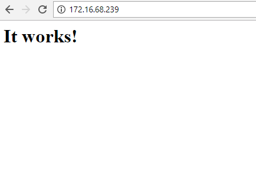

## Cài đặt docker

## Yêu cầu
- Ubuntu Server 16.04 64 bit
- Docker version 17.12.0-ce, build c97c6d6

## Các bước cài đặt.
- Đăng nhập vào máy chủ Ubuntu bằng quyền root
- Tải các thành phần phụ trợ

  ```sh
  apt-get update -y
  ```

  ```
  sudo apt-get -y install \
    apt-transport-https \
    ca-certificates \
    curl \
    software-properties-common
  ```
  
- Add repos của Docker

  ```sh
  curl -fsSL https://download.docker.com/linux/ubuntu/gpg | sudo apt-key add -
  ```
  
  ```sh
  sudo add-apt-repository -y \
    "deb [arch=amd64] https://download.docker.com/linux/ubuntu \
    $(lsb_release -cs) \
    stable"
  ```

- Cài đặt docker

  ```sh
  sudo apt-get -y update
  sudo apt-get -y install docker-ce
  ```

- Khởi động và kích hoạt docker 

  ```sh
  systemctl start docker
  systemctl enable docker
  ```

- Kiểm tra phiên bản docker vừa cài đặt.

  ```sh
  docker --version
  ```  
  - Kết quả trả về là 
    ```sh
    Docker version 17.12.0-ce, build c97c6d6
    ```
   
- Tạo container đầu tiên để thử nghiệm

  ```sh
  docker run -d -p 80:80 httpd
  ```  
  Trong đó:
    - `-d` là tùy chọn để container chạy ngầm (chạy liên tục sau khi hoàn thành xong lệnh)
    - `-p 80:80` là tùy chọn để cho phép port của máy chủ cài docker ánh xạ tới port của container.
    - `httpd` là image được dùng để tạo ra container.
  
  Kết quả của lệnh `docker run -d -p 80:80 httpd`
  
  ```sh
  root@devstack1:~# docker run -d -p 80:80 httpd
  Unable to find image 'httpd:latest' locally
  latest: Pulling from library/httpd
  4176fe04cefe: Pull complete
  d6c01cf91b98: Pull complete
  b7066921647a: Pull complete
  643378aaba88: Pull complete
  3c51f6dc6a3b: Pull complete
  4f25e420c4cc: Pull complete
  ccdbe37da15c: Pull complete
  Digest: sha256:6e61d60e4142ea44e8e69b22f1e739d89e1dc8a2764182d7eecc83a5bb31181e
  Status: Downloaded newer image for httpd:latest
  53458790a068c405d7e5991c9931dddf9a3263b8f439084c363fa55af05fb9e7
  ```
  
Trong kết quả trên ta thấy có 2 bước xử lý chính.
- (Pull) Kéo (tải) images `httpd:latest` về vì lần đầu tiên tạo container không tìm thấy images này. Images `httpd` này được tải qua internet từ docker hub. Lưu ý: Việc tải images này cũng có thể thực hiện qua việc xây dựng một máy chủ chứa các images trong mạng LAN.
- Sau khi tải xong (pull) images `httpd`, máy sẽ tạo ra container và ánh xạ port 80 của host vào port 80 của container.  


Mở trình duyệt web và truy cập vào địa chỉ của máy cài đặt docker, ta sẽ có trang web hiển thị.



Ngoài ra có thể tìm hiểu thêm các lệnh cơ bản để làm việc với docker ở dưới để thành thạo trước khi chuyển sang tài liệu kế tiếp, một vài lệnh cở bản.

- Kiểm tra trạng thái của các container đang hoạt động.
  ```sh
  docker ps
  ```
  - Kết quả:
  ```sh
  root@devstack1:~# docker ps
  CONTAINER ID        IMAGE               COMMAND              CREATED             STATUS              PORTS                NAMES
  53458790a068        httpd               "httpd-foreground"   7 minutes ago       Up 7 minutes        0.0.0.0:80->80/tcp   upbeat_tereshkova
  ````
  Trong kết quả trên ta có thể quan sát các cột để có thêm thông tin về hoạt động của container (hãy chú ý cột `CONTAINER ID, STATUS và PORTS`. Có thể thực hiện lệnh `docker ps -a` để hiện thị toàn bộ các container - trong đó bao gồm các container đã tạm dừng hoạt động. 
    
  
- Kiểm tra danh sách của các images

  ```sh
  docker images
  ```
  - Kết quả  
  ```sh
  REPOSITORY          TAG                 IMAGE ID            CREATED             SIZE
  httpd               latest              01154c38b473        10 days ago         177MB
  ````

- Xem thông tin chi tiết của container `docker inspect ID_Hoac_ten_container`. Kết quả trả về là các thông tin chi tiết bên trong container, các thông tin này sẽ được thảo luận kỹ ở các mục sau.

  ```sh
  docker inspect 53458790a068
  ```

- Xóa container vừa tạo ở trên bằng lệnh `docker rm -f  ID_Hoac_ten_container`, (Nếu bạn theo tài liệu này thì hãy khoan thực hiện bước này vì giữu lại container này để tiếp tục ở bài sau).

  ```sh
  docker rm -f  53458790a068
  ```


