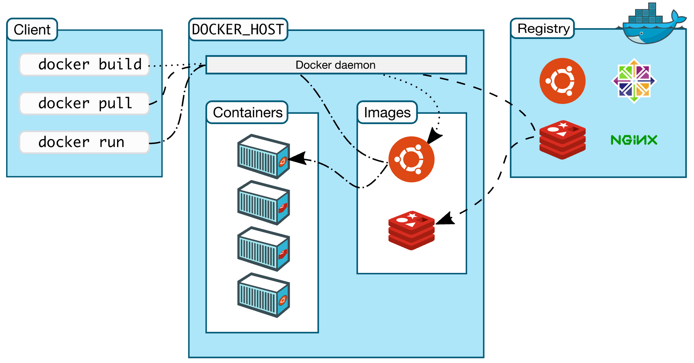

## Các thành phần của docker hoạt động như thế nào.
- Phần này sẽ giới thiệu về quá trình tạo ra một container

### Các thành phần cơ bản của Docker
- Hình dưới mô tả thành phần cở bản của Docker



Trong hình trên có các thành phần cơ bản như sau
- `docker client` là thành phần cung cấp dòng lệnh để thao tác và điều khiển docker host.
- `docker host` là máy chủ được cài đặt docker deamon, thành phần chính để điều khiển các contaner.
- `registry` là thành phần lưu trữ các images, nó có thể là máy chủ online được cung cấp bởi các nhà cung cấp hoặc do chính các công ty tự dựng.
- `container` sẽ được tạo ra từ các `images`
- Các thao tác `run, pull, build` sẽ được thao tác bởi người dùng.

### Cơ chế làm việc của các thành phần

Trong ví dụ trước về việc tạo một container với images là `httpd` ta đã có kết quả như sau


Trong hình trên ta sẽ có các bước chính sau:
- `1` Docker client sẽ thực hện lệnh `docker run` để khởi tạo container.
- `2` Docker deamon thông báo không tìm thấy images có tên là `httpd` tại local
- `3` Vì không tìm thấy images `httpd` nên máy sẽ tiến hành tải images `httpd` từ docker hub về. Trong ví dụ này là tải online từ internet.
- `4` Quá trình tài hoàn tất.
- `5` docker deamon sẽ tiến hành tạo container và kết thúc quá trình tạo docker.

Để quan sát images `httpd` vừa tải ở trên ta sẽ sử dụng lệnh `docker images`
  ```sh
  root@devstack1:~# docker images
  REPOSITORY          TAG                 IMAGE ID            CREATED             SIZE
  httpd               latest              01154c38b473        10 days ago         177MB
  ```

Để quan sát container ta dùng lệnh `docker ps` hoặc `docker container ls`

  ```sh
  root@devstack1:~# docker container ls
  CONTAINER ID        IMAGE               COMMAND              CREATED             STATUS              PORTS                NAMES
  53458790a068        httpd               "httpd-foreground"   5 hours ago         Up 5 hours          0.0.0.0:80->80/tcp   upbeat_tereshkova
  ```

  ```sh
  root@devstack1:~# docker ps
  CONTAINER ID        IMAGE               COMMAND              CREATED             STATUS              PORTS                NAMES
  53458790a068        httpd               "httpd-foreground"   5 hours ago         Up 5 hours          0.0.0.0:80->80/tcp   upbeat_tereshkova
  ```


Kết luận:
- Việc sử dụng các images sẽ giúp người triển khai tiết kiệm được thời gian và đơn giản hóa trong quá trình cài đặt, nếu bạn biết thêm các ứng dụng khác thì bạn có thể gõ lệnh `docker run` để thực hiện việc tạo ra các container tương ứng với các ứng dụng.
- Các container hoàn toàn có thể tạo ra, xóa, sửa, thay đổi và tùy chỉnh theo yêu cầu. Trong các phần sau chúng ta sẽ chi tiết hơn về các thao tác này.


