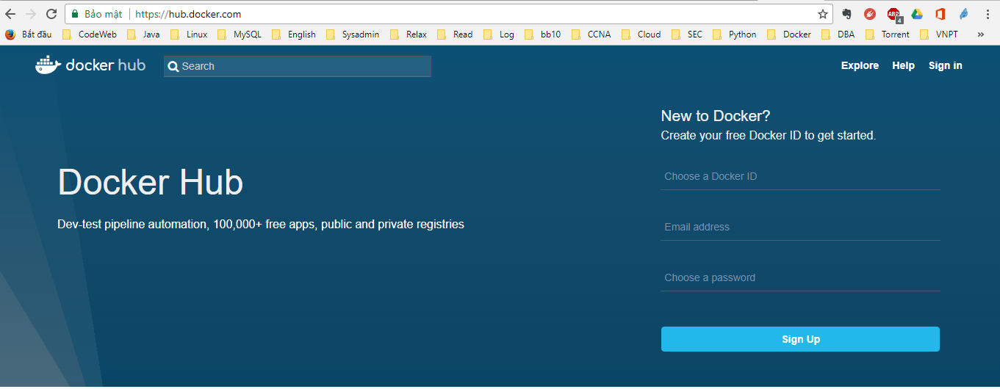
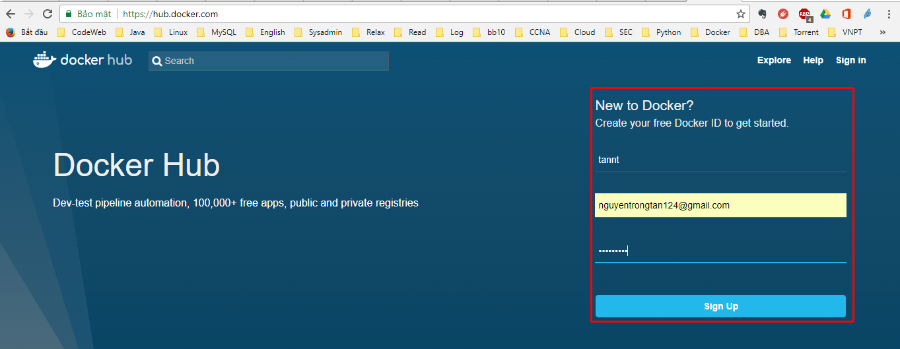
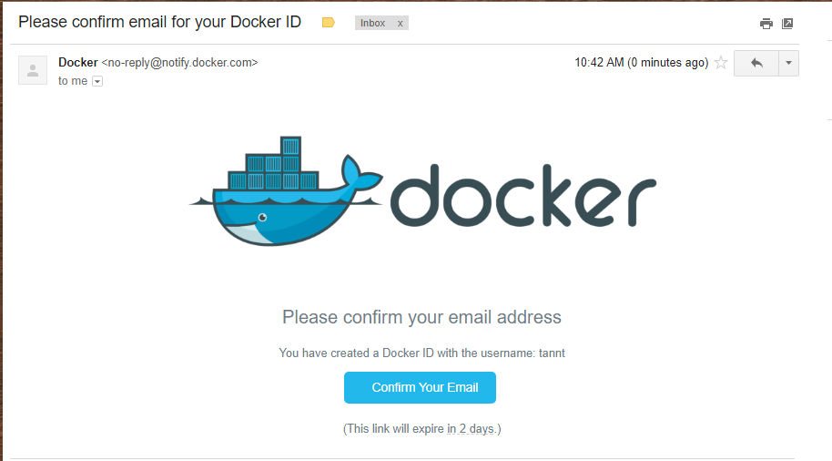
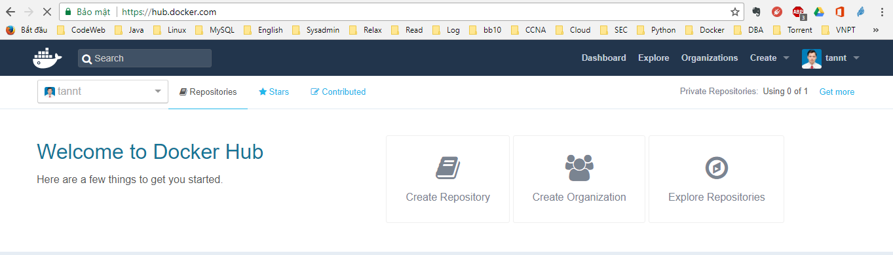
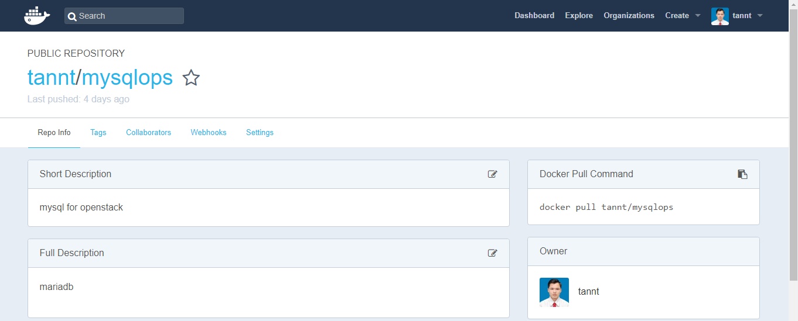

# Backup và Recovery Docker Containers

____

# Mục lục

- [1. Docker containers backup](#backup)
- [2. Docker containers recovery](#recovery)
- [Các nội dung khác](#content-others)

____

# <a name="content">Nội dung</a>

- Nội dung của bài viết này sẽ nói về cách thực hiện backup và recovery Docker containers. 

- Để hiểu về quá trình backup và recovery, đầu tiên cần phải hiểu về sự khác nhau giữa Docker image và Docker containers:

    + Docker image là template để tạo ra các container. Tức là các container được chạy từ các images này.

    + Docker containers là một biểu hiện cụ thể được tạo ra từ images.

- Nội dung của bài viết sẽ thực hiện backup container và `push` lên Docker Hub thay vì lưu container thành một tarball. Vì vậy, yêu cầu đã có một tài khoản người dùng tại Docker Hub. Có thể đăng ký tài khoản tại [Docker Hub](https://hub.docker.com)

    Truy cập vào trang `hub.docker.com`

    

    Điền thông tin vào form đăng ký

    

    Mở email xác nhận đăng ký

    

    Thực hiện đăng nhập để bắt đầu sử dụng

    

    Nhấn vào `Create repository` để tạo mới một repo lưu image bạn mong muốn

    

- ### <a name="backup">1. Docker containers backup</a>

    + Khi cần backup Docker containers, chúng ta sẽ `commit` trạng thái hiện tại của containers và sau đó sẽ thực hiện lưu nó giống như một Docker image. Giả sử, ta có thông tin về containers như sau:

            # docker ps -a
    
            CONTAINER ID    IMAGE    COMMAND                   CREATED          STATUS          PORTS     NAMES
            dbeba4b48741    nginx    "nginx -g 'daemon of…"    9 minutes ago    Up 9 minutes    80/tcp    docker-nginx

    + Từ ouput trên, ta có thể thấy Docker Host đang có một container tên là `docker-nginx` đang chạy với `container id` là `dbeba4b48741`. Bây giờ, chúng ta cần sử dụng câu lệnh `docker commit` để `snapshot` lại trạng thái hiện tại của container với câu lệnh như sau:

            docker commit -p dbeba4b48741 username/docker-nginx

        trong đó: 

        - `-p` có ý nghĩa sẽ tạm dừng container trong khi đang commit.
        - `username` là thông tin về tên người dùng sử dụng để đăng nhập vào Docker Hub
        - `docker-nginx` là tên của repository của image được tạo ra. Mặc định repository sẽ được gắn tag là `latest`. Để thực hiển `push` image lên `Docker Hub`, ta cần phải đặt tên của image kèm theo `username` giống như bên trên.

        kết quả sẽ hiển thị tương tự như sau:

            sha256:c3731be100382b261fce742035ec3e02d95145a468bb3e9d028fff599aa6ecab

    + Sau khi thực hiện câu lệnh trên, ta có thể kiểm tra kết quả với câu lệnh như sau:

            docker images

        kết quả sẽ hiển thị tương tự như sau:

            REPOSITORY      TAG       IMAGE ID        CREATED          SIZE
            username/docker-nginx    latest    c3731be10038    4 minutes ago    108MB

    + Ngay lúc này, container được backup đã được lưu lại như một image tại Docker host để có thể triển khai một cách nhanh chóng. Nếu chúng ta muốn triển khai một image của container backup trên một Docker host khác. Ta có thể `push` nó lên một private repository có sẵn của Docker. Để thực hiện, ta cần phải đăng nhập vào Docker Hub với thông tin của `Username/ Password` tương ứng:

            docker login

        sau khi đăng nhập thành công, sẽ nhận được thông báo:

            Login Succeeded

    + Sau khi đã thực hiện `commit` container, ta có thể tiến hành `push` image được tạo ra với câu lệnh như sau:

            docker push username/docker-nginx

        kết quả sẽ hiển thị tương tự như sau:

            The push refers to repository [docker.io/reministry/docker-nginx]
            5262f3ce40c4: Pushed
            a103d141fc98: Pushed
            73e2bd445514: Pushed
            2ec5c0a4cb57: Pushed
            latest: digest: sha256:c51c0d1a8a876851515673458b02edacc074eaafd3e5268298becac2c9ab8998 size: 1155

    + Ta có thể kiểm tra kết quả bằng việc đi đến trang web [Docker Hub](https://hub.docker.com), thực hiện đăng nhập với tài khoản người dùng đã có trước đó.

    + Ta cũng có thể backup containers theo dạng tarball và di chuyển nó đến một Docker Host khác để triển khai với câu lệnh như sau:

            docker save docker-nginx -o docker-nginx.tar

        kết quả, sẽ có một file `docker-nginx.tar` được tạo ra trong thư mục chạy câu lệnh.

- ### <a name="recovery">2. Docker containers recovery</a>

    + Để thực hiện recovery từ một tarball file image trước đó đã tạo. Ta có thể sử dụng câu lệnh sau:

            docker load -i docker-nginx.tar

        trong đó:

        - `-i` dùng để khai báo luồng đọc file
        - `docker-nginx.tar` là đường dẫn đến tarball file.

    + Để thực hiện recovery từ một image trên Docker Hub. Ta chỉ cần thực hiện sử dụng câu lệnh sau:

            docker pull username/docker-nginx

____

## Tài liệu tham khảo

- [Docker container: Backup and Recovery - LinuxConfig.org](https://linuxconfig.org/docker-container-backup-and-recovery)
____

# <a name="content-others">Các nội dung khác</a>
