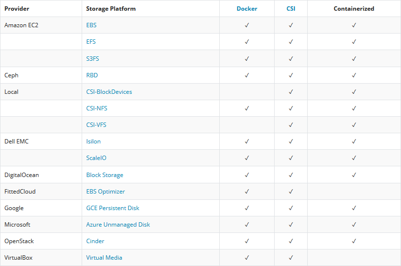
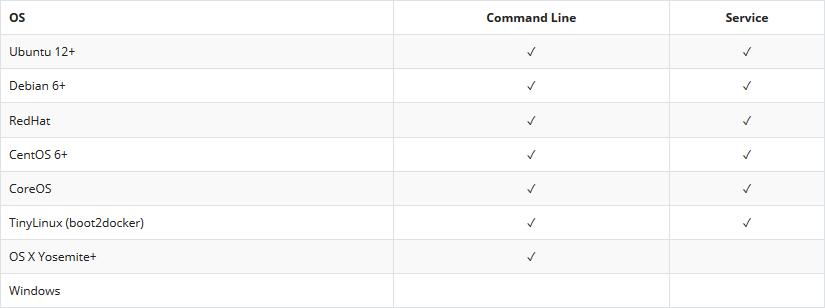
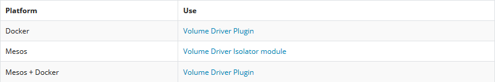
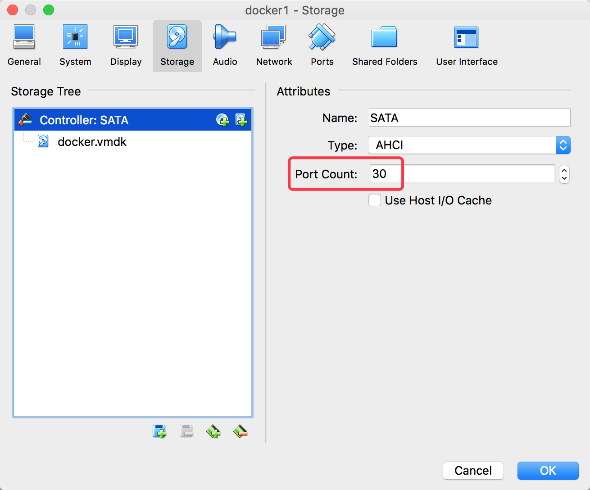

# Sử dụng plugin rexray trong Docker sử dụng ảo hóa VirtualBox

____

# Mục lục

- [1. Giới thiệu về Rex-ray](#about)
- [2. Cài đặt Rex-ray](#setting)
- [3. Sử dụng Rex-ray với Docker](#with-docker)
- [4. Kiểm tra kết quả](#result)
- [Các nội dung khác](#content-others)

____

# <a name="content">Nội dung</a>

- ### <a name="about">1. Giới thiệu về Rex-ray</a>

    - Rex-ray là một `Docker volume driver` hoạt động độc lập trên các máy chủ Docker với việc cài đặt khá đơn giản.
    - Rex-ray giao tiếp với `Storage Providers` để có thể quản lý các volume mong muốn.

        > 

        được hỗ trợ trên nhiều nền tảng hệ điều hành:

        > 

        và hỗ trợ container flatforms như:

        > 

- ### <a name="setting">2. Cài đặt Rex-ray</a>

    - Để cài đặt Rexray, ta sẽ tiến hành cài đặt trên Docker Host. sử dụng câu lệnh sau:

            curl -sSL https://rexray.io/install | sh

        kết quả sẽ hiển thị tương tự như sau:

            ...
            REX-Ray
            -------
            Binary: /usr/bin/rexray
            Flavor: client+agent+controller
            SemVer: 0.11.2
            OsArch: Linux-x86_64
            Commit: fc8bfbd2d02c2690fc3a755a9560dd12c88e0852
            Formed: Sun, 25 Feb 2018 06:51:22 +07

- ### <a name="with-docker">3. Sử dụng Rex-ray với Docker</a>

    - Nội dung của bài viết này, sẻ tiến hành triển khai sử dụng `Storage Provider` là `VirtualBox` trên hệ điều hành `Windows.` Các cấu hình và cách thực hiện đều `tương tự trên hệ điều hành Linux`.

    - Sau khi đã cài đặt `VirtualBox` và tạo ra một máy ảo Docker (hệ điều hành Ubuntu) sử dụng VirtualBox. Ta cần tiến hành thực hiện cấu hình cho máy ảo Docker các yêu cầu bắt buộc sau:

        > 

        > 

    - Tiếp theo, ta thực hiện cài đặt Rex-ray trong Docker Host như bên trên và thực hiện cấu hình cho Rex-ray như sau:

            vi /etc/rexray/config.yml

        sau đó thêm nội dung sau vào file và lưu lại:

            libstorage:
              service: virtualbox
              integration:
                volume:
                  operations:
                    create:
                      default:
                        size: 2
                    mount:
                      preempt: true
            virtualbox:
              endpoint: http://20.10.20.1:18083
              volumePath: E:/VMWare/VirtualBox/Volumes
              controllerName: SATA

        trong đó:

        | Nội dung | Mô tả |
        | ------------- | ------------- |
        | 20.10.20.1 | Là địa chỉ IP của máy cài đặt VirtualBox |
        | E:/VMWare/VirtualBox/Volumes | Là đường dẫn sử dụng lưu trữ các disk mà rex-ray sẽ tạo ra |

    - Tiếp theo, ta cần phải thực hiện khởi chạy `Web Service` của VirtualBox. Các câu lệnh được thực hiện tại máy cài đặt VirtualBox.

        + Đối với Linux:

                VBoxManage setproperty websrvauthlibrary null
                vboxwebsrv -H 0.0.0.0

        + Đối với Windows:

            - Thực hiện mở `Command Prompt` tại thư mục cài đặt của VirtualBox. Sau đó thực hiện chạy câu lệnh sau:

                    VBoxManage setproperty websrvauthlibrary null
                    vboxwebsrv -H 0.0.0.0
        
    - Tiếp đến, ta cần phải khởi động Rex-ray. Thực hiện sử dụng câu lệnh sau trong Docker Host:

            systemctl restart rexray

    - Như vậy, ta đã cài đặt hoàn chỉnh Rex-ray để có thể sẵn sàng sử dụng cùng với Docker Host.

- ### <a name="result">4. Kiểm tra kết quả</a>

    - Trong nội dung này, ta sẽ thực hiện sử dụng rexray để thao tác với disk local. Sau khi đã tiến hành thực hiện các bước trên. Ta thực hiện kiểm tra tính năng của rex-ray như sau:

        + Tạo một disk mới sử dụng câu lệnh sau:

                docker volume create --driver rexray --name=mydata --opt=size=2

            hoặc

                rexray volume create mydata --size 2

        + Kết quả, ta có thể kiểm tra được như sau:

                rexray volume ls
            
            sẽ hiển thị tương tự như sau:

            ```sh
            ID                                    Name              Status     Size
            5d7bae33-655b-4552-97e8-4a029c9852bd  Ubuntu 16.04.vdi  attached   10
            c465dde9-f8fd-4ae7-b48c-8fd1697cbf67  mydata            available  2

            ```

            hoặc:

                docker volume ls

            sẽ hiển thị tương tự như sau:

            ```sh
            DRIVER              VOLUME NAME
            rexray              Ubuntu 16.04.vdi
            rexray              mydata
            ```

        + Hiện tại, disk ta vừa tạo ra đang ở trạng thái `available` tức chưa được sử dụng. Ta cần phải sử dụng nó để dễ dàng quan sát được tính năng thực sự của rex-ray với câu lệnh sau:

                docker run --name ctn-alpine --mount mydata:/home alpine

            sau đó, ta sẽ kiểm tra kết quả bằng cách vào phần cài đặt của máy ảo Docker Host. Trong phần Storage ta thấy được đã có một disk tên là `mydata` được tạo ra.

        + Như vậy, Rex-ray đã thực hiện giao tiếp với VirtualBox để điều phối các hoạt động liên quan đến vấn đề storage. Hãy tạo một vài dữ liệu trong thư mục `/home` của container `ctn-alpine` sau đó xóa container đi và sử dụng lại volume bởi một container khác để kiểm tra xem dữ liệu có còn hay không.
____

# <a name="content-others">Các nội dung khác</a>

- Tham khảo series bài viết [如何安装和配置 Rex-Ray？- 每天5分钟玩转 Docker 容器技术（74） - CloudMan - 博客园](http://www.cnblogs.com/CloudMan6/p/7607705.html)