# 5. Giới thiệu về Docker Swarm - Swarm Mode.

____

# Mục lục

- [5.1 Docker Swarm là gì?](#docker-swarm)
- [5.2 Các khái niệm cần biết khi làm việc với Swarm](#concepts)
    - [5.2.1 Khái niệm nodes](#concepts-nodes)
    - [5.2.2 Khái niệm services and tasks](#concepts-services-tasks)
    - [5.2.3 Load Balancing](#concepts-load-balancing)
- [Các nội dung khác](#content-others)

____

# <a name="content">Nội dung</a>

- ### <a name="docker-swarm">5.1 Docker Swarm là gì?</a>

    - Swarm trong Docker được sử dụng để tạo dựng cluster quản lý nhiều Docker Engine. Có thể sử dụng Docker CLI để tạo ra swarm, triển khai các dịch vụ ứng dụng trong swarm và quản lý các hành vi của swarm.

    - Swarm bao gồm nhiều Docker Host chạy trong `swarm mode` hoạt động ở hai vai trò:

        + `manager`: Có chức năng quản lý các host trong cluster, các dịch vụ, ...
        + `worker`: Có chức năng chạy services, ...

        một Docker host có thể là một manager node, worker hoặc thậm chí có cả hai vai trò. Khi ta tạo ra service, ta cần phải xác định trạng thái tối ưu của nó (số lượng replicas, network và tài nguyên storage cung cấp cho nó, ports cho containers, ...). Docker hoạt động để duy trì các trạng thái mong muốn. Ví dụ, nếu một worker node trở nên không khả dụng, các task của node sẽ được thêm mới tới các node khác.

    - Các tính năng nổi bật của Docker Swarm bao gồm:

        + `Quản lý Cluster được tích hợp với Docker Engine`: Sử dụng Docker CLI để tạo ra swarm để triển khai các dịch vụ. Không cần thiết phải có thêm các phần mềm khác để tạo và quản lý swarm.

        > 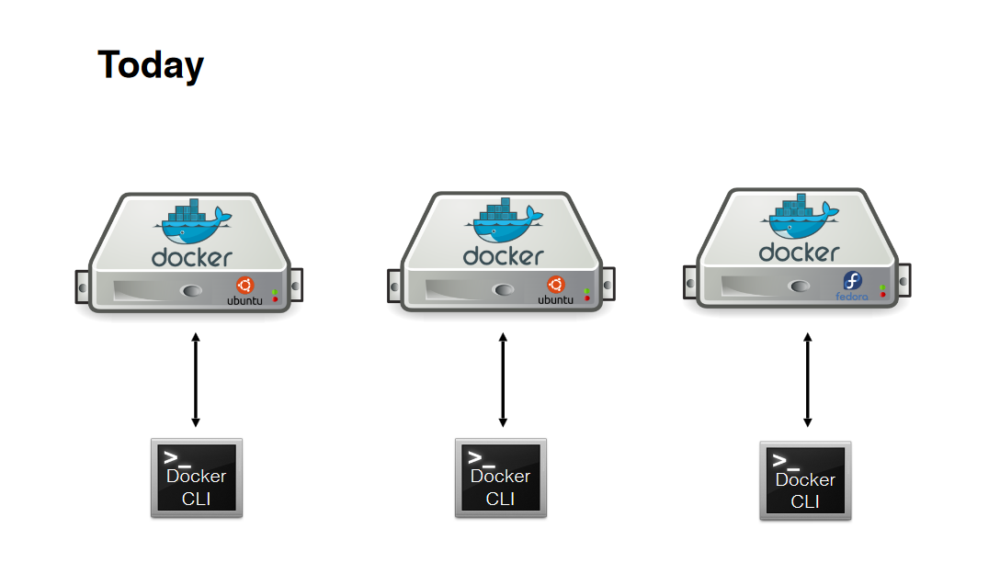

        với Docker Swarm, ta có thể:

        > 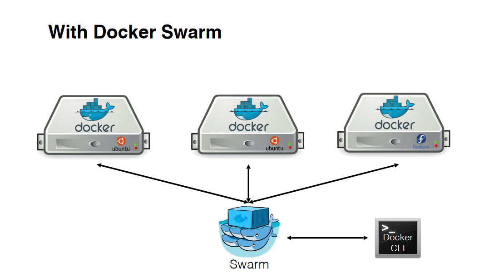

        + `Triển khai phân tán`: Thay vì xử lý các khác biệt giữa vai trò của các node trong thời gian triển khai, Docker Engine sẽ xử lý bất kỳ tác vụ nào đang chạy. Ta có thể triển khai cả hai loại node là `manager` và `workers` sử dụng Docker Engine. Điều này có nghĩa ta có thể tạo ra một Docker Swarm hoàn chỉnh chỉ từ một image duy nhất.

        + `Scaling`: Đối với mỗi dịch vụ triển khai trong Docker Swarm, bạn có thể khai báo số lượng `task` muốn chạy. Khi bạn mở rộng quy mô hay ngược lại, Docker Swarm sẽ tự động điều chỉnh bằng cách thêm hoặc xóa `task` để duy trì trạng thái mong muốn - tình trạng hệ thống ta cần đạt được.

        + `Đảm bảo tính ổn định`: Docker Swarm sẽ liên tục giám sát trạng thái của cluster và giải quyết bất kỳ sự thay đổi nào giữa trạng thái thực tế và trạng thái mong muốn dựa trên các quyết định của bạn. Ví dụ: Ta thiết lập một dịch vụ với 5 bản sao containers và worker node có lưu trữ 2 bản sao containers. Manager node sẽ tự động tạo ra 2 bản sao containers khác nếu như 2 bản sao containers trong worker node bị lỗi, ... Manager Node sẽ luôn luôn đảm bảo các bản sao containers mới cho worker đang chạy hoặc được cung cấp.

        > 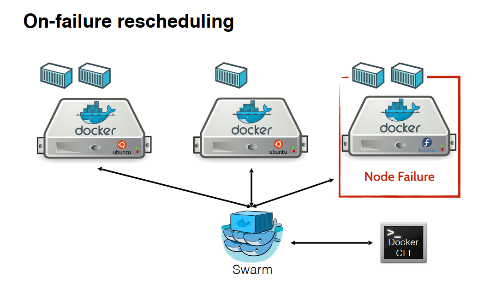

        Manager node sẽ thực hiện:

        > 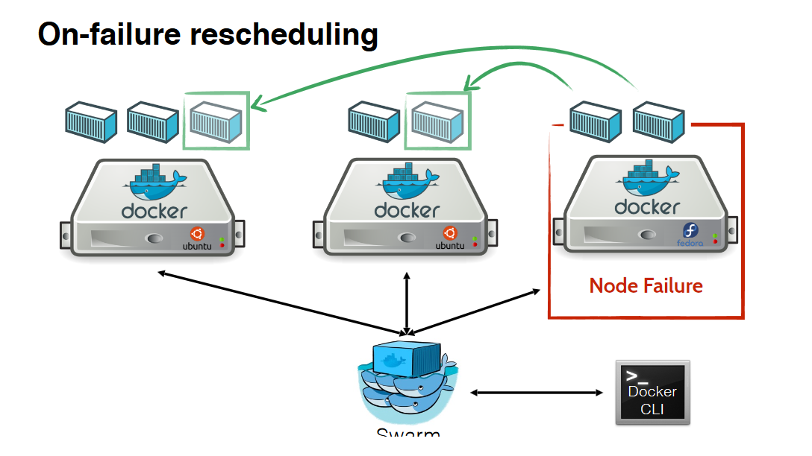

        + `Multi-host networking`: Có thể khai báo overlay network cho các dịch vụ trong Swarm. Docker Swarm sẽ tự động quản lý và gán địa chỉ IP cho mỗi container trên overlay network khi nó khởi tạo hoặc update ứng dụng.

        + `Service discovery`: Swarm manager node sẽ chỉ định mỗi dịch vụ trong Docker Swarm ứng với một tên DNS duy nhất và cân bằng tải các containers đang chạy. Ta có thể thực hiện truy vấn tất các containers đang chạy trong Swarm thông qua một DNS Server được nhúng vào Swarm.

        + `Load Balancing`: Bạn có thể `expose` ports cho các dịch vụ tới một load balancer bên ngoài. Trong Swarm, cho phép bạn chỉ định làm thể nào để phân phối services giữa các node.

        + `Rolling Update`: Tại một thời điểm, ta có thể áp dụng việc cập nhật ứng dụng (chủ yếu là phiên bản images) cho các node một cách tăng dần. Swarm manager cho phép ta kiểm soát được thời gian delay giữa việc triển khai services tới các node khác. Nếu có lỗi phát sinh xảy ra, ta có thể quay lại phiên bản trước của services.

        + `High Availability, State Replication`: Docker Swarm cho phép nhân bản trạng thái của Docker node trong Swarm. Hãy theo dõi thứ tự các hình ảnh sau để hiểu rõ hơn về tính năng này của Docker.

            + Đầu tiên, ta có mô hình như sau:

            > 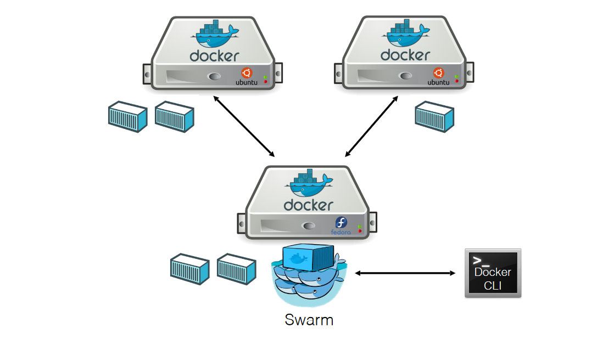

            mô hình này chưa thực sự đảm bảo về tính năng vì `manager node` có thể bị lỗi khiến Swarm không được cung cấp:

            > 

            > 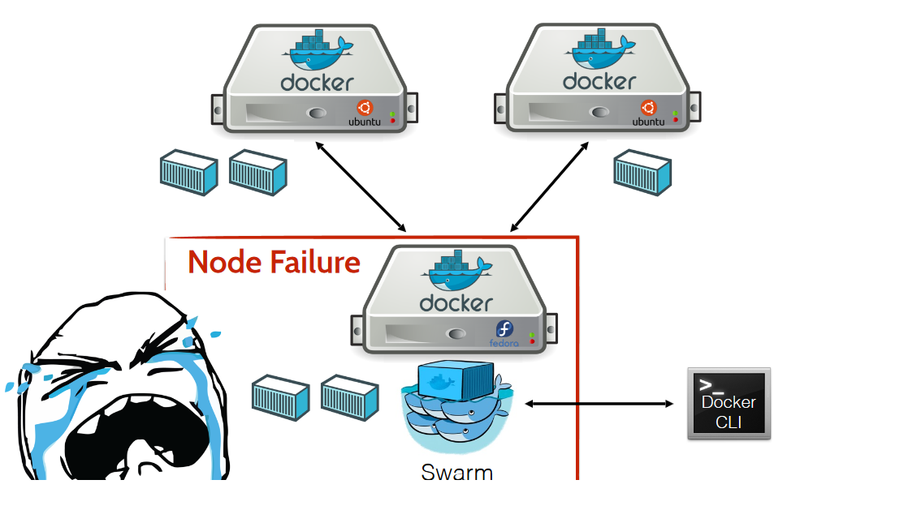

            Với Docker Swarm, ta có thể triển khai nhiều `manager node` cùng một lúc:

            > 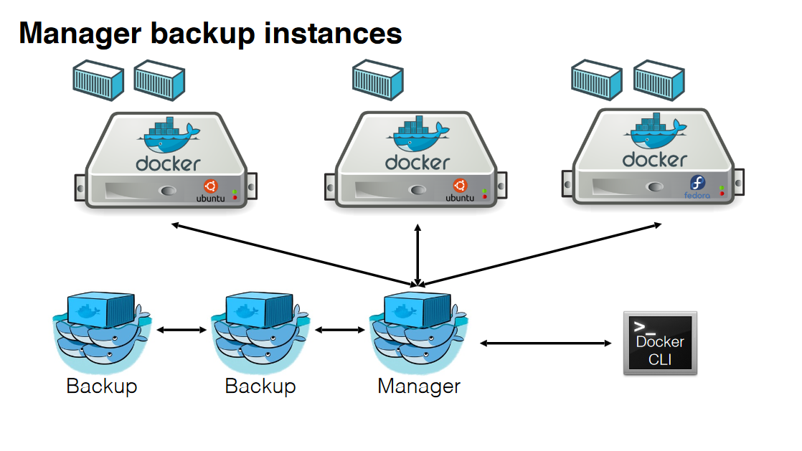

            Khi một `manager node` đang hoạt động bị crash:

            > 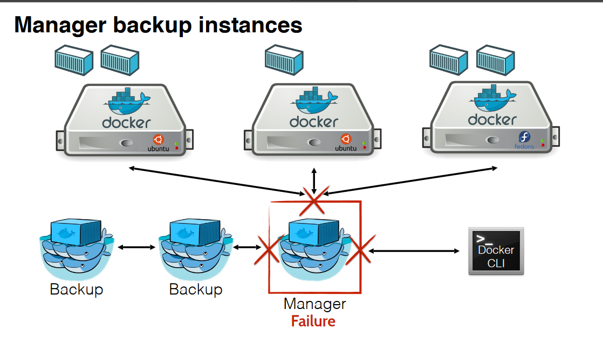

            `manager node` sẽ được tự động chuyển chức năng quản lý sang một node khác (node backup):

            > 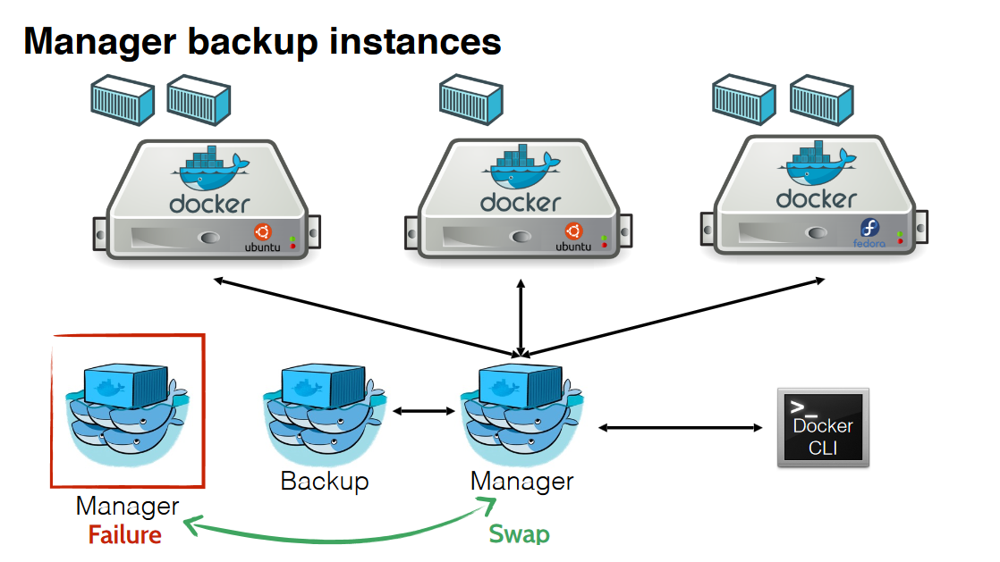

- ### <a name="concepts">5.2 Các khái niệm cần biết khi làm việc với Swarm</a>
    - ### <a name="concepts-nodes">5.2.1 Khái niệm nodes</a>
        
        + `node` là một biểu hiện của Docker Engine tham gia vào swarm. Bạn cũng có thể nghĩ nó như một Docker node. Bạn có thể chạy một hoặc nhiều nodes trên duy nhất một máy tính vật lý hay cloud server nhưng việc triển khai swarm thường bao gồm các Docker node được phân phối trên nhiều máy tính và cloud machine.

            > 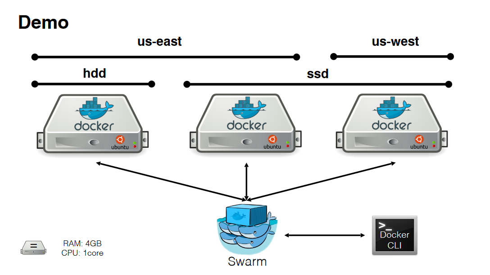

        + Để có thể triển khai ứng dụng của bạn trong swarm, bạn cần phải khai báo service thông qua `manager node`. Manager node sẽ thực hiện gửi các task (đơn vị công việc) tới `worker node`.

        + `manager node` thực hiện điều hành và quản lý các chức năng yêu cầu của cluster để duy trì trạng thái mong muốn trong swarm. `manager node` sẽ chọn một `leader` duy nhất để quản lý và điều hành tasks.

        + `worker node` có chức năng nhận và thực hiện tasks được gửi từ `manager node`. Mặc định, `manager node` cũng hoạt động như `worker node` (cũng chạy các dịch vụ). Nhưng ta cũng có thể cấu hình để chỉ định services chỉ có thể chạy trên node có vai trò nào. Một agent chạy trên mỗi worker node và thông báo về tasks giao cho worker node. Worker node sẽ thông báo tới manager node trạng thái hiện tại của tasks được giao để manager node có thể duy trì trạng thái mong muốn của mỗi worker node.

    - ### <a name="concepts-services-tasks">5.2.2 Khái niệm services and tasks</a>

        + `Service` định nghĩa cho một task được thực thi trong manager node hoặc worker node. Là cấu trúc trung tâm của Docker Swarm. Và là yếu tố chủ yếu được người dùng tương tác xử lý trong Swarm.

        + Khi ta tạo một service, ta có thể chỉ định image nào được sử dụng và câu lệnh nào được thực thi bên trong containers đang chạy. Một trong các ưu điểm của swarm service trong các containers độc lập với nhau đó là ta có thể sửa đổi cấu hình bao gồm networks, volumes được kết nối tới containers mà không cần phải restart một cách thủ công nữa. Docker Swarm sẽ tự động dừng tasks với cấu hình đã cũ và tạo ra các tasks mới phù hợp với cấu hình mong muốn.

        + Service có thể được triển khai theo hai hình thức:

            - `replicated services`: Swarm manager sẽ thực hiện phân phối một số lượng cụ thể giữa các bản sao của task so với số lượng node dựa trên quy mô ta mong muốn.  Đây là hình thức mặc định được sử dụng khi một service được tạo ra.

            - `global services`: Swarm chạy một task cho service trên tất cả các node khả dụng trong cluser.

        + `Task` là một container đang chạy và là một phần của một service và được quản lý bởi Swarm manager, trái ngược với container độc lập.

        + `Task` bao gồm container và các câu lệnh chạy bên trong container. Được coi là một đơn vị dịch vụ trong Swarm. Manager node phân chia task cho worker node theo số lượng bản sao được hướng đến trong quy mô của services. Khi một task được gán cho một node, ta không thể thực hiện di chuyển nó đến node khác. Nó chỉ có thể chạy trên node được chỉ định hoặc không.
    - ### <a name="concepts-load-balancing">5.2.3 Load Balancing</a>

        - Swarm manager sử dụng `ingress load balancing` để expose services bạn muốn cung cấp ra bên ngoài Swarm. Swarm manager có thể tự động gán service với một `PublishedPort` hoặc bạn cũng có thể cấu hình `PublishedPort` cho service. Có thể khai báo bất kỳ một port nào không sử dụng cho service. Nếu bạn không khai báo port, Swarm manager sẽ tự động gán port trong khoảng 30000 ~ 32676.

        - Các thành phần bên ngoài, chẳng hạn như cân bằng tải trên cloud server có thể truy cập service thông qua `PublishedPort` của bất kỳ node nào trong cluster swarm cho dù node đó hiện đang không có task vụ nào của dịch vụ truy cập được chạy.

        > !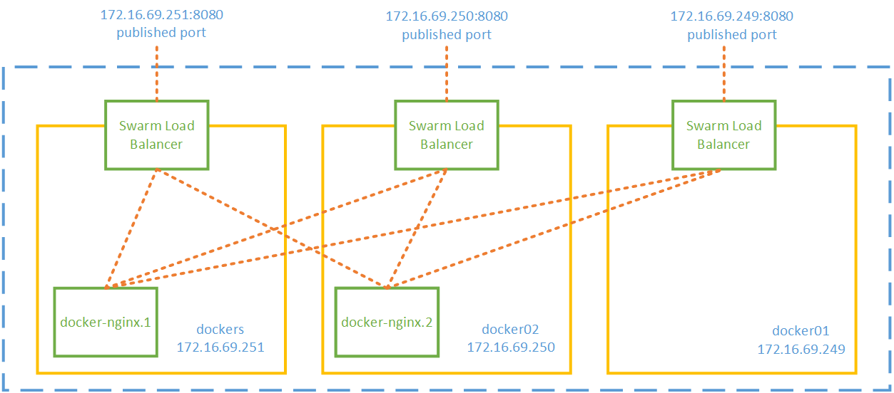

        - Swarm mode có một thành phần là DNS nội bộ tự động gán mỗi service trong Swarm với một DNS name. Swarm manager sử dụng `internal load balancing` để phân phối các request giữa các service trong cluster dựa trên tên DNS của service.

____

# <a name="content-others">Các nội dung khác</a>
