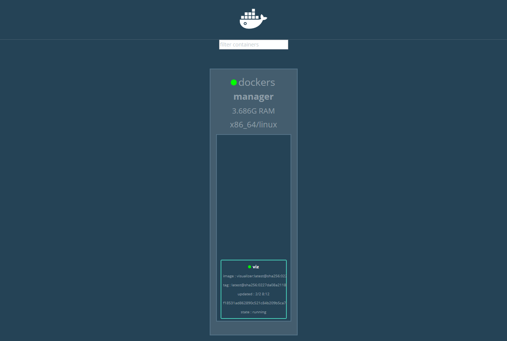

# 6. Tạo và quản lý cluster swarm trong Docker

____

# Mục lục

- [6.1 Các yêu cầu cần có để thực hiện](#requirement)
- [6.2 Tạo ra Swarm Docker](#swarm-init)
- [6.3 Thêm Docker node tới Docker Swarm](#add-nodde)
- [6.4 Triển khai một dịch vụ](#deploy-service)
- [6.5 Inspect service](#inspect-service)
- [6.6 Scale service](#scale-service)
- [6.7 Drain node](#drain-node)
- [6.8 Định tuyến trong Docker Swarm](#routing-mesh)
- [6.9 Dựng Docker Swarm Visualizer để theo dõi services](#docker-swarm-visualizer)
- [Các nội dung khác](#content-others)

____

# <a name="content">Nội dung</a>

- ### <a name="requirement">6.1 Các yêu cầu cần có để thực hiện</a>

    - Mô hình đơn giản như sau:

    > 

    - Việc thực hiện cấu hình sử dụng ít nhất 3 node lần lượt đáp ứng yêu cầu theo bảng sau:

        | STT | Hostname |   IP Address  |   OS   |
        | --- | -------- | ------------- | ------ |
        |  1  | docker01 | 172.16.69.249 | CentOS |
        |  2  | docker02 | 172.16.69.250 | CentOS |
        |  3  | dockers  | 172.16.69.251 | CentOS |

    - Các node đã được cài đặt Docker Engine phiên bản mới nhất hiện tại (1.12 trở đi).

    - Trên các node có cần được publish các port như sau:

        | STT | Port | Protocols |            Chức năng                  |
        | --- | ---- | --------- | --------------------------------------|
        |  1  | 2377 |    tcp    | for cluster management communications |
        |  2  | 7946 |  tcp/udp  | for communication among nodes         |
        |  3  | 4789 |    udp    | for overlay network traffic           |

    - Để thực hiện publish các port trên CentOS ta có thể chạy các câu lệnh sau:

            firewall-cmd --add-port=2377/tcp --permanent
            firewall-cmd --add-port=7946/tcp --permanent
            firewall-cmd --add-port=7946/udp --permanent
            firewall-cmd --add-port=4789/udp --permanent

            firewall-cmd --reload

    - Việc thực hiện được tiến hành sử dụng ảo hóa VMWare.

- ### <a name="swarm-init">6.2 Tạo ra Swarm Docker</a>

    - Thực hiện chạy câu lệnh sau trên node `dockers` để khởi tạo Swarm:

            docker swarm init --advertise-addr 172.16.69.251

        kết quả

            Swarm initialized: current node (dxn1zf6l61qsb1josjja83ngz) is now a manager.

            To add a worker to this swarm, run the following command:

                docker swarm join \
                --token SWMTKN-1-49nj1cmql0jkz5s954yi3oex3nedyz0fb0xx14ie39trti4wxv-8vxv8rssmk743ojnwacrr2e7c \
                172.16.69.251:2377

            To add a manager to this swarm, run 'docker swarm join-token manager' and follow the instructions.

    - Kiểm tra thông tin về Docker Swarm, ta có thể sử dụng câu lệnh:

            docker info

        kết quả sẽ hiển thị tương tự như sau:

            Containers: 2
            Running: 0
            Paused: 0
            Stopped: 2
              ......
            Swarm: active
              NodeID: dxn1zf6l61qsb1josjja83ngz
              Is Manager: true
              Managers: 1
              Nodes: 1
              ......

        hoặc

            docker node ls

        kết quả sẽ hiển thị tương tự như sau:

            ID                           HOSTNAME  STATUS  AVAILABILITY  MANAGER STATUS
            dxn1zf6l61qsb1josjja83ngz *  dockers  Ready   Active        Leader

        Dấu ` * ` trong phần ID thể hiện rằng bạn đang kết nối tại node đó.

- ### <a name="add-nodde">6.3 Thêm Docker node tới Docker Swarm</a>

    - Thực hiện chạy câu lệnh theo chỉ dẫn khi ta chạy câu lệnh khởi tạo Swarm trên node `dockers` lần lượt trên cả hai node `docker01` và `docker02`. Ví dụ:

            Swarm initialized: current node (dxn1zf6l61qsb1josjja83ngz) is now a manager.

            To add a worker to this swarm, run the following command:

                docker swarm join \
                --token SWMTKN-1-49nj1cmql0jkz5s954yi3oex3nedyz0fb0xx14ie39trti4wxv-8vxv8rssmk743ojnwacrr2e7c \
                172.16.69.251:2377

            To add a manager to this swarm, run 'docker swarm join-token manager' and follow the instructions.

        thì ta chạy câu lệnh như sau:

            docker swarm join \
            --token SWMTKN-1-49nj1cmql0jkz5s954yi3oex3nedyz0fb0xx14ie39trti4wxv-8vxv8rssmk743ojnwacrr2e7c \
            172.16.69.251:2377

        hoặc nếu như không thể xem lại kết quả thì ta có thể chạy câu lệnh sau và làm theo hướng dẫn tại kết quả của câu lệnh:

            docker swarm join-token manager

        kết quả sẽ hiển thị tương tự trên cả hai node như sau:

            This node joined a swarm as a worker.

    - Để kiểm tra kết quả, ta sử dụng câu lệnh sau trên node `dockers`:

            docker node ls

        kết quả sẽ hiển thị tương tự như sau:

            ID                           HOSTNAME  STATUS  AVAILABILITY  MANAGER STATUS
            03g1y59jwfg7cf99w4lt0f662    docker02   Ready   Active
            9j68exjopxe7wfl6yuxml7a7j    docker01   Ready   Active
            dxn1zf6l61qsb1josjja83ngz *  dockers    Ready   Active        Leader

- ### <a name="deploy-service">6.4 Triển khai một dịch vụ</a>

    - Để deploy một dịch vụ, ta thực hiện sử dụng câu lệnh sau trên node `dockers`:

            docker service create \
            --name docker-nginx \
            --publish published=8080,target=80 \
            --replicas 1 \
            nginx

        trong đó:

        | Chỉ dẫn | Mô tả |
        | ------------- | ------------- |
        | docker service create | Câu lệnh để tạo ra một service |
        | --name | flag khai báo tên của service. Ở đây là docker-nginx |
        | --replicas | flag khai báo số lượng mong muốn của service chạy là 1 |
        | --publish | flag khai báo publish port |

    - Để kiểm tra kết quả, ta sử dụng câu lệnh sau trên node `dockers`:

            docker service ls

        kết quả hiển thị tương tự như sau:

            ID                  NAME                MODE                REPLICAS            IMAGE               PORTS
            dktyt4ml5qq7        docker-nginx        replicated          1/1                 nginx:latest        *:8080->80/tcp

- ### <a name="inspect-service">6.5 Inspect service</a>

    - Để biết chi tiết về service `docker-nginx`. Ta sử dụng câu lệnh sau trên node `dockers`:

            docker service inspect --pretty docker-nginx

        flag `--pretty` có tác dụng phân tích cú pháp JSON thành dạng dễ quan sát hơn. Kết quả sẽ hiển thị tương tự như sau:

            ID:             dktyt4ml5qq7hdags8iyjkp3n
            Name:           docker-nginx
            Service Mode:   Replicated
             Replicas:      1
            Placement:
            UpdateConfig:
             Parallelism:   1
             On failure:    pause
             Monitoring Period: 5s
             Max failure ratio: 0
             Update order:      stop-first
            RollbackConfig:
             Parallelism:   1
             On failure:    pause
             Monitoring Period: 5s
             Max failure ratio: 0
             Rollback order:    stop-first
            ContainerSpec:
             Image:         nginx:latest@sha256:285b49d42c703fdf257d1e2422765c4ba9d3e37768d6ea83d7fe2043dad6e63d
            Resources:
            Endpoint Mode:  vip
            Ports:
             PublishedPort = 8080
              Protocol = tcp
              TargetPort = 80
              PublishMode = ingress

        hoặc câu lệnh `docker service ps docker-nginx` cũng trên node `dockers`. Kết quả sẽ hiển thị tương tự như sau:

            ID            NAME            IMAGE         NODE      DESIRED STATE  CURRENT STATE          ERROR  PORTS
            1zmpj3x713sw  docker-nginx.1  nginx:latest  docker02  Running        Running 4 minutes ago

- ### <a name="scale-service">6.6 Scale service</a>

    - Để scale service, ta thực hiện sử dụng câu lệnh sau trên node `dockers`:

            docker service scale docker-nginx=2

        trong đó: 2 là số lượng sẽ được scale. Kết quả ta sẽ có 2 container `docker-nginx.1` và `docker-nginx.2`.

    - Ta có thể kiểm tra kết quả bằng cách sử dụng câu lệnh:

            docker service ls

        kết quả hiển thị tương tự như sau:

            ID                  NAME                MODE                REPLICAS            IMAGE               PORTS
            dktyt4ml5qq7        docker-nginx        replicated          2/2                 nginx:latest        *:8080->80/tcp

- ### <a name="drain-node">6.7 Drain node</a>

    - Trong Docker Swarm, các worker có thể được gán chỉ định là `ACTIVE` khi muốn node đó có thể nhận tasks hoặc `DRAIN` khi muốn node đó dừng chạy các task và thôi nhận tasks mới (được sử dụng khi có kế hoạch bảo trì node.)

    - Để thực hiện chỉ định một node là `DRAIN`. Ta sử dụng câu lệnh trên node `manager` có cú pháp như sau:

            docker node update --availability drain <NODE-ID>

        ví dụ:

            docker node update --availability drain dockers01

    - Để kiểm tra kết quả, ta có thể sử dụng câu lệnh sau trên manager node:

            docker service ps docker-nginx

        trong đó `docker-nginx` là tên của service

- ### <a name="routing-mesh">6.8 Định tuyến trong Docker Swarm</a>

    - Với Docker Swarm, ta có thể dễ dàng public port để có thể truy cập tới services từ bên ngoài. Tất cả các node đều được sử dụng `routing mesh`. `routing mesh` cho phép mỗi node trong swarm có thể chấp nhận các kết nối trên published port cho các service đang chạy trong swarm, ngay cả khi không có task nào đang chạy trên node. `routing mesh` sẽ định tuyến tất cả các request tới một node có container đang chạy.

    > 

    Như vậy, ta có thể truy cập tới service theo bất kỳ địa chỉ IP của node nào.

- ### <a name="docker-swarm-visualizer">6.9 Dựng Docker Swarm Visualizer để theo dõi service</a>

    - Khi sử dụng Docker Swarm, ta nên cài đặt thêm `Swarm Visualizer` để dễ dàng theo dõi các services có trong `Swarm Cluster`. Để thực hiện cài đặt, ta sử dụng câu lệnh:

            docker service create \
            --name=viz \
            --publish=8080:8080/tcp \
            --constraint=node.role==manager \
            --mount=type=bind,src=/var/run/docker.sock,dst=/var/run/docker.sock \
            dockersamples/visualizer

    - Sau khi chạy xong, ta có thể truy cập đến đường dẫn với port `ip_address:8080` để kiểm tra kết quả. Nếu cài đặt thành công, kết quả sẽ hiển thị tương tự như sau:

        

# Tài liệu tham khảo

- https://docs.docker.com/engine/swarm/swarm-tutorial/
- http://trumhemcut.net/2016/06/26/gioi-thieu-cac-tinh-nang-moi-trong-docker1-12/

____

# <a name="content-others">Các nội dung khác</a>

