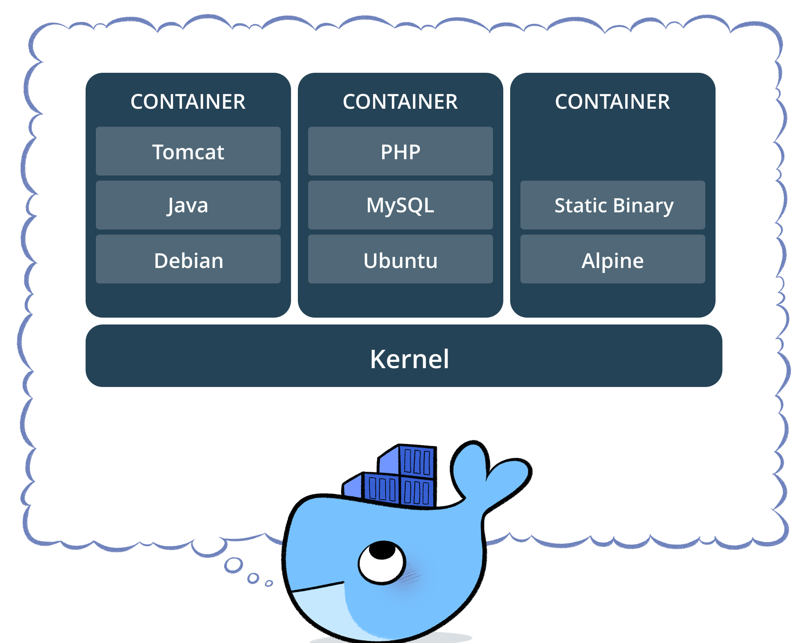
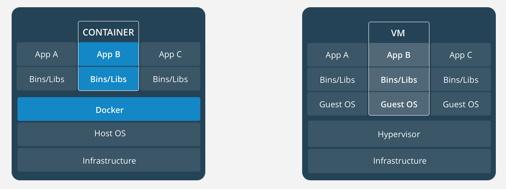
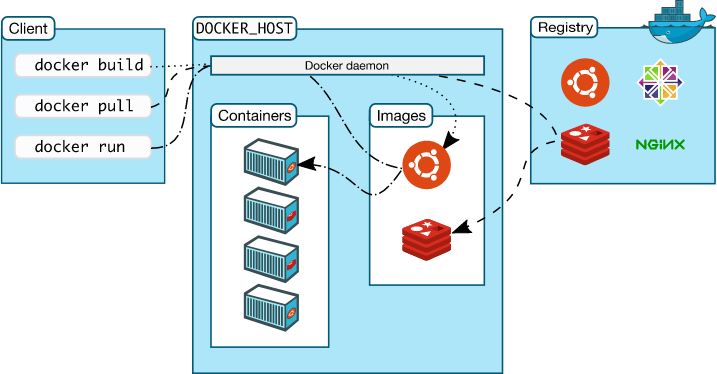

# 1. Giới thiệu về Docker

____

# Mục lục

- [1.1 Docker là gì?](#whatis)
- [1.2 Chức năng, vai trò của Docker?](#about)
- [1.3 Các khái niệm cần biết khi sử dụng docker](#concepts)
    - [1.3.1 Image](#image)
    - [1.3.2 Registry](#registry)
    - [1.3.3 Volume](#volume)
    - [1.3.4 Container](#container)
    - [1.3.5 Dockerfile](#docker-file)
- [1.4 Các thành phần, kiến trúc trong Docker](#compose)
- [1.5 Các trạng thái, thứ tự chuyển giao trạng thái của container trong Docker](#workflow)
- [1.6 Network trong Docker](#network)
- [1.7 Volume trong Docker](#volume)
- [Các nội dung khác](#content-others)

____

# <a name="content">Nội dung</a>

- ### <a name="whatis">1.1 Docker là gì?</a>

    - Docker là một ứng dụng mã nguồn mở cho phép độc lập triển khai giữa các ứng dụng và cơ sở hạ tầng đối với các nhà phát triển và mở ra tiềm năng tạo nên một mô hình cho sự hợp tác tốt và đổi mới hơn.

    - Docker giải quyết vấn đề khi mà các doanh nghiệp ngày nay đang chịu áp lực phải chuyển đổi kỹ thuật số nhưng bị hạn chế bởi các ứng dụng và cơ sở hạ tầng hiện tại đồng thời hợp lý hóa danh mục cloud, trung tâm dữ liệu và kiến trúc ứng dụng ngày càng đa dạng.

- ### <a name="about">1.2 Chức năng, vai trò của Docker?</a>

    - Cho phép phát triển, di chuyển và chạy các ứng dụng dựa vào công nghệ ảo hóa container trong Linux.

    - Tự động triển khai các ứng dụng bên trong các container bằng cách cung cấp thêm một lớp trừu tượng và tự động hóa việc ảo hóa "mức hệ điều hành".

    - Docker có thể sử dụng được trên cả 3 hệ điều hành phổ biến: Windows, Linux và Mac OS.

    - Lợi ích của docker bao gồm:

        + Nhanh trong việc triển khai, di chuyển, khởi động container
        + Bảo mật
        + Lightweight (tiết kiệm disk & CPU)
        + Mã nguồn mở
        + Hỗ trợ APIs để giao tiếp với container
        + Phù hợp trong môi trường làm việc đòi hòi phải liên tục tích hợp và triển khai các dịch vụ, phát triển cục bộ, các ứng dụng multi-tier.

- ### <a name="concepts">1.3 Các khái niệm cần biết khi sử dụng docker</a>
    - ### <a name="image">1.3.1 Image</a>

        + Image trong Docker hay còn gọi là Mirror. Là một template có sẵn (hoặc có thể tự tạo) với các chỉ dẫn dùng để tạo ra các container. 

        + Được xây dựng từ một loạt các layers. Mỗi layer là một kết quả đại diện cho một lệnh trong Dockerfile.

        + Lưu trữ dưới dạng read-only template.

    - ### <a name="registry">1.3.2 Registry</a>

        + Docker Registry là nơi lưu trữ các image với hai chế độ là private và public.

        + Là nơi cho phép chia sẻ các image template để sử dụng trong quá trình làm việc với Docker.

    - ### <a name="volume">1.3.3 Volume</a>

        + Volume trong Docker là nơi dùng để chia sẻ dữ liệu cho các container.

        + Có thể thực hiện sử dụng Volume đối với 2 trường hợp:

            - Chia sẻ giữa container với container.
            - Chia sẻ giữa container và host.

    - ### <a name="container">1.3.4 Container</a>

        + Docker Container là một thể hiện của Docker Image với những thao tác cơ bản để sử dụng qua CLI như start, stop, restart hay delete, ...

        + Container Image là một gói phần mềm thực thi lightweight, độc lập và có thể thực thi được bao gồm mọi thứ cần thiết để chạy được nó: code, runtime, system tools, system libraries, settings. Các ứng dụng có sẵn cho cả Linux và Windows, các container sẽ luôn chạy ổn định bất kể môi trường.

            > 

        + Containers and virtual machines có sự cách ly và phân bổ tài nguyên tương tự, nhưng có chức năng khác vì các container ảo hóa hệ điều hành thay vì phần cứng. Các container có tính portable và hiệu quả hơn.

            > 

            - Container là một sự trừu tượng hóa ở lớp ứng dụng và code phụ thuộc vào nhau. Nhiều container có thể chạy trên cùng một máy và chia sẻ kernel của hệ điều hành với các container khác, mỗi máy đều chạy như các quá trình bị cô lập trong không gian người dùng. Các container chiếm ít không gian hơn các máy ảo (container image thường có vài trăm thậm chí là vài MB), và start gần như ngay lập tức.

            - Máy ảo (VM) là một sự trừu tượng của phần cứng vật lý chuyển tiếp từ một máy chủ sang nhiều máy chủ. Hypervisor cho phép nhiều máy ảo chạy trên một máy duy nhất. Mỗi máy ảo bao gồm một bản sao đầy đủ của một hệ điều hành, một hoặc nhiều ứng dụng, các chương trình và thư viện cần thiết - chiếm hàng chục GB. Máy ảo cũng có thể khởi động chậm.

    - ### <a name="docker-file">1.3.5 Dockerfile</a>

        - Docker Image có thể được tạo ra một cách tự động bằng việc đọc các chỉ dẫn trong Dockerfile.

        - Dockerfile là một dữ liệu văn bản bao gồm các câu lệnh mà người sử dụng có thể gọi qua các dòng lệnh để tạo ra một image.

        - Bằng việc sử dụng `docker build` người dùng có thể tạo một tự động xây dựng thực hiện một số lệnh dòng lệnh liên tiếp.

- ### <a name="compose">1.4 Các thành phần, kiến trúc trong Docker</a>

    > 

    - Hình ảnh bên trên là mô tả về `Docker Engine`. Theo đó, `Docker Engine` là một ứng dụng client-server với các thành phần chính:

        + Một máy chủ đảm nhiệm thực hiện quá trình daemon (chạy câu lệnh `dockerd`).
        + REST API xác định các giao diện mà các chương trình có thể sử dụng để nói chuyện với daemon và hướng dẫn nó phải làm gì.
        + Một CLI (chạy câu lệnh `docker`).

    - CLI sẽ sử dụng Docker REST API để kiểm soát hoặc tương tác với Docker daemon thông qua kịch bản hoặc lệnh CLI trực tiếp.

        > 

    - Docker sử dụng kiến trúc client-server. Docker client sẽ giao tiếp với Docker daemon các công việc building, running và distributing các Docker Container.

    - Docker client và Docker daemon có thể chạy cùng trên một hệ thống hoặc ta có thể kết nối một Docker client tới một remote Docker daemon. Docker client và Docker daemon liên lạc với nhau bằng việc sử dụng REST API thông qua UNIX sockets hoặc network interfaces.

    - Docker daemon (dockerd ) sẽ lắng nghe các request từ Docker API và quản lý Docker objects bao gồm images, containers, networks và volumes. Một daemon cũng có thể liên lạc với các daemons khác để quản lý Docker services.

    - Docker client (docker ) là con đường chính để những người sử dụng Docker tương tác và giao tiếp với Docker. Khi sử dụng mộ câu lệnh chẳng hạn như `docker run` thì client sẽ gửi câu lệnh tới dockerd để thực hiện câu lệnh. Các câu lệnh từ Docker client sử dụng Docker API và có thể giao tiếp với nhiều Docker daemon.

- ### <a name="workflow">1.5 Các trạng thái, sự chuyển giao trạng thái của container trong Docker</a>

    Hình ảnh dưới đây mô tả cho một vòng đời của container trong Docker cùng với các trạng thái hoạt động:

    > 

- ### <a name="network">1.6 Network trong Docker</a>

    Dưới đây là hình ảnh mô tả kiến trúc Network của Container hay còn gọi là Container Networking Model (CNM).

    > 

    Đây là cấu trúc mức độ cao trong CNM. Theo đó, ta có:

    + Sandbox - Chứa các cấu hình của ngăn xếp mạng container. Bao gồm quản lý network interface, route table và các thiết lập DNS. Một Sandbox có thể được coi là một namespace network và có thể chứa nhiều endpoit từ nhiều mạng.

    + Endpoint - Là điểm kết nối một Sandbox tới một mạng.

    + Network - CNM không chỉ định một mạng tuân theo mô hình OSI. Việc triển khai mạng có thể là VLAN, Bridge, ... Các endpoint không kết nối với mạng thì không có kết nối trên mạng.

    - CNM cung cấp 2 interface có thể được sử dụng cho việc liên lạc, điều khiển, ... container trong mạng:

        - `Network Drivers` - Cung cấp, thực hiện thực tế việc tạo ra một mạng hoạt động. Được sử dụng với các drivers khác và thay đổi một cách dễ dàng đối với các trường hợp cụ thể. Nhiều network driver có thể được sử dụng trong Docker nhưng mỗi một network chỉ là một khởi tạo từ một network driver duy nhất. Theo đó mà ta có 2 loại chính của CNM network drivers như sau:

            + `Native Network Drivers` - Là một phần của Docker Engine và được cung cấp bới Docker. Có nhiều drivers để dễ dàng lựa chọn cho khả năng của mạng như overlay networks hay local bridges.

            + `Remote Network Drivers` - Là các network drivers được tạo ra bởi cộng đồng và các nhà cung cấp. Được sử dụng để tích hợp vào các phần mềm hoặc phần cứng đang hoạt động.

        - `IPAM Drivers`: Drivers quản lý các địa chỉ IP cung cấp mặc định cho các mạng con hoặc địa chỉ IP cho các mạng và endpoint nếu chúng không được chỉ định. Địa chỉ IP cũng có thể gán thủ công qua mạng, container, ...

    - Giao tiếp giữa docker engine - libnetwork - driver

        > 

    - `Docker Native Network Drivers` - là một phần của Docker Engine và không yêu cầu cần phải có nhiều modules. Được gọi và sử dụng thông qua các câu lệnh `docker network`. Dưới đây là native network hiện có:

        | Driver | Mô tả |
        | ------------- | ------------- |
        | Host | Với host driver, một container sẽ sử dụng ngăn xếp mạng của host. Không có sự phân biệt giữa namespace, tất cả các interface trên host có thể được sử dụng trực tiếp bởi container |
        | Bridge | Bridge driver tạo ra Linux bridges trên host và được quản lý bởi Docker. Mặc định, containers trên một bridge có thể liên lạc với nhau. Việc truy cập từ bên ngoài tới các container có thể được cấu hình thông qua bridge driver.  |
        | Overlay | Overlay driver tạo ra một overlay network hỗ trợ cho các mạng multi-host. Được sử dụng kết hợp với Linux bridges và VXLAN để che đi liên lạc giữa các container qua cơ sở mạng hạ tầng vật lý. |
        | MACVLAN | MACVLAN driver sử dụng chế độ MACVLAN bridge để thiết lập kết nối giữa container interface và host interface (hoặc sub-interface). Nó có thể được sử dụng để cung cấp địa chỉ IP cho các container và định tuyến trên mạng vật lý. Ngoài ra VLANs có thể được trunked đến MACVLAN driver |
        | None | None driver cho một ngăn xếp mạng riêng và namespace nhưng không cấu hình interfaces bên trong container. Nếu không có cấu hình bổ sung, container hoàn toàn bị cô lập khỏi mạng của host |

    - Đối với native driver network trong container. Ta có:

        + Chiều outbound khi các container sử dụng trong container 

            > 

        + Chiều inbound khi các container sử dụng trong container 

            > 

        + Container kết nối với network thông quan docker0 interface:

            > 
    

- ### <a name="volume">1.7 Volume trong Docker</a>

    + Volume là một thư mục đặc biệt được chỉ định trong một hoặc nhiều container.

    + Volumes được thiết kế để duy trì dữ liệu, độc lập với vòng đời của container.

    + Do đó, Docker sẽ không bao giờ tự động xóa volumes khi ta xóa bỏ containers. Còn được biết đến là `data volume`.

    - Có 3 kiểu volume đó là: host, anonymous, named:

        + `host volume` - tồn tại trên filesystem của Docker host và có thể được truy cập từ bên trong container.

        + `named volume`- là volume được Docker quản lý và được đặt tên.

        + `anonymous volume`- tương tự như `named volume`. Tuy nhiên rất khó để có thể tham vấn tới cùng một volume theo thời gian khi volume là một đối tượng vô danh. Lưu trữ các tập tin mà Docker xử lý.

____

# <a name="content-others">Các nội dung khác</a>
