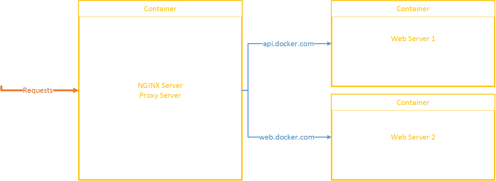
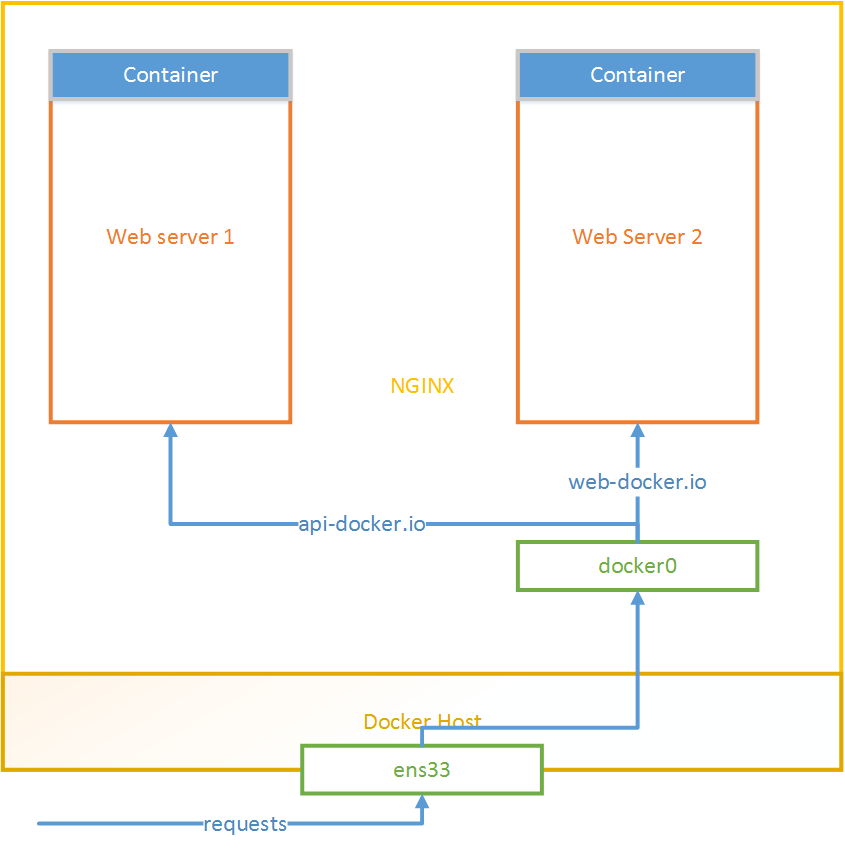
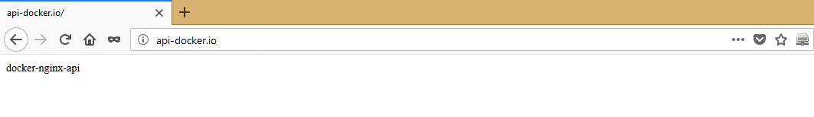
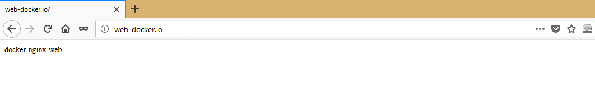

# A. Cấu hình NGINX sử dụng tính năng Proxy Server trong Docker

____

# Mục lục

- [1. Mục đích thực hiện cấu hình](#issue)
- [2. Mô hình và yêu cầu](#models)
- [3. Cách thực hiện cấu hình](#config)
- [4. Kiểm tra kết quả](#test)
- [Các nội dung khác](#content-others)

____

# <a name="content">Nội dung</a>

- ### <a name="issue">1. Mục đích thực hiện cấu hình</a>

    - Nhằm giải quyết vấn đề khi ta có duy nhất một địa chỉ IP public và nhiều website có nhu cầu dùng chung địa chỉ IP public mà ta có. Việc truy cập tới các website đòi hỏi truy cập qua các domain khác nhau.
    
    - Việc cấu hình áp dụng tính năng Virtual Domain và Reverse Proxy của NGINX.

- ### <a name="models">2. Mô hình và yêu cầu</a>

    Đây là 2 mô hình thực hiện cấu hình Docker:

    > 

    Yêu cầu:

    - Có 3 Docker container. Trong đó có ít nhất một container cài đặt NGINX để đóng vai trò như Proxy Server, 2 container còn lại đóng vai trò là Web Server.

    - Thực hiện cấu hình trên VMWare.

    và

    > 

    Yêu cầu:
    - Cần có 2 Docker container Web
        - Thực hiện cấu hình trên VMWare
        - Docker host sử dụng hệ điều hành CentOS 7.

- ### <a name="config">3. Cách thực hiện cấu hình</a>
    - Dưới đây là cách thực hiện cấu hình cho mô hình thứ nhất - Mô hình sử dụng 3 containers

    > 

    - Đầu tiên, ta cần phải tạo ra 3 container:

            docker create --name docker-nginx-api nginx

            docker create --name docker-nginx-web nginx

            docker create --name docker-nginx-ps -p 80:80 --link docker-nginx-api --link docker-nginx-web nginx

    
    - Tiếp theo, ta cần thay đổi nội dung file `index.html` để dễ dàng trong việc kiểm tra kết quả khi truy cập. Sử dụng các câu lệnh sau:

            echo "docker-nginx-ps" > index.html && docker cp index.html docker-nginx-ps:/usr/share/nginx/html/index.html

            echo "docker-nginx-api" > index.html && docker cp index.html docker-nginx-api:/usr/share/nginx/html/index.html

            echo "docker-nginx-web" > index.html && docker cp index.html docker-nginx-web:/usr/share/nginx/html/index.html

    - Thêm file cấu hình tới container có tên là `docker-nginx-ps` bằng cách thực hiện như sau:

            wget https://pastebin.com/raw/bLxmrEsQ

            docker cp bLxmrEsQ docker-nginx-ps:/etc/nginx/conf.d/proxy_server.conf

    - Lần lượt khởi chạy container để kiểm tra kết quả. Lưu ý, container `docker-nginx-ps` phải được khởi chạy sau cùng.

            docker start docker-nginx-web

            docker start docker-nginx-api

            docker start docker-nginx-ps

____

- Sau đây là cách thực hiện cấu hình cho mô hình thứ hai - Mô hình chỉ sử dụng 2 containers

    > 

- Đầu tiên, ta cần phải tạo ra 2 container:

        docker create --name docker-nginx-api nginx

        docker create --name docker-nginx-web nginx

- Tiếp theo, ta cần thay đổi nội dung file `index.html` để dễ dàng trong việc kiểm tra kết quả khi truy cập. Sử dụng các câu lệnh sau:

        echo "docker-nginx-api" > index.html && docker cp index.html docker-nginx-api:/usr/share/nginx/html/index.html

        echo "docker-nginx-web" > index.html && docker cp index.html docker-nginx-web:/usr/share/nginx/html/index.html

- Tiếp theo cài đặt NGINX lên trên Docker host:
    - Thêm nginx repository bằng việc tạo một file */etc/yum.repos.d/nginx.repo* bằng câu lệnh sau:

            sudo vi /etc/yum.repos.d/nginx.repo

        sau đó thêm nội dung này vào file:

            [nginx]
            name=nginx repo
            baseurl=http://nginx.org/packages/mainline/centos/7/$basearch/
            gpgcheck=0
            enabled=1

    - Update lại hệ thống:

           sudo yum update

    - Cài đặt nginx sử dụng câu lệnh:

          sudo yum install nginx -y

- Thêm file cấu hình NGINX bằng cách thực hiện như sau:

        wget https://pastebin.com/raw/bLxmrEsQ

        cp bLxmrEsQ /etc/nginx/conf.d/proxy_server.conf

- Thiết lập trỏ host cho container bằng việc thêm chúng vào file `/etc/hosts` với nội dung tương tự như sau:

        ip-container-web docker-nginx-web
        ip-container-api docker-nginx-api

    trong đó: ip-container-web, ip-container-api lần lượt là địa chỉ IP của 2 container docker-nginx-web và docker-nginx-web (Sử dụng câu lệnh `docker inspect` để lấy địa chỉ IP).

- Khởi động NGINX với câu lệnh:

        systemctl start nginx
        
        systemctl enable nginx

- Open port để client có thể truy cập:

        firewall-cmd --add-port=80/tcp --permanent
        firewall-cmd --reload

- ### <a name="test">4. Kiểm tra kết quả</a>

    > Việc kiểm tra kết quả thực hiện giống nhau trong cả 2 mô hình

    - Trên máy local sử dụng Windows, ta thực hiện trỏ host bằng việc thêm nội dung:

            ip_address   api-docker.io web-docker.io

        tới file `C:\Windows\System32\drivers\etc\hosts`, trong đó `ip_address` là địa chỉ IP của máy ảo cài `Docker host`.

    - Tại trình duyệt, ta tiến hành truy cập lần lượt tới các địa chỉ và thu được kết quả tương ứng như sau:

        + Địa chỉ `api-docker.io`:

            > 

        + Địa chỉ `web-docker.io`:

            > 

    Như vậy ta đã thực hiện cấu hình xong.
____

# <a name="content-others">Các nội dung khác</a>
