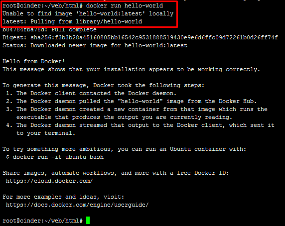

# Thực hành container

Liệt kê số lượng container đang chạy (run) trên host:
```sh
docker ps
```

Thêm tham số `-a` để liệt kê tất cả các container đang có trên host (bao gồm cả đang chạy và dừng):
```sh
docker ps -a
```

Tạo một container từ image, nếu image không có sẵn trên local host thì docker sẽ tìm trên `docker hub` image phiên bản `latest` để tải về và chạy:
```sh
docker run ubuntu
```

- Thay `ubuntu` bằng image mà bạn muốn tạo ra container.

Ví dụ:



Đặt tên cho một container khi khởi tạo, thêm tham số `--name`
```sh
docker run --name ubuntu_test ubuntu
```

Tạo một docker và sử dụng terminal của docker
```sh
docker run -it --name ubuntu_test1 ubuntu /bin/bash
```

**Note**: Chỉ sử dụng tham số `-it` thì khi thoát terminal của docker bằng `exit`, docker sẽ bị dừng.

Chỉ định chạy một docker dưới nền như một deamon. 
```sh
docker run -d ubuntu /bin/bash
```

Vào terminal của một container đang chạy
```sh
docker exec -it ubuntu_test1 /bin/bash
```

- Thay `ubuntu_test1` bằng tên của container
- Chỉ vào terminal của một container khi kiểm tra trạng thái của container bằng lệnh `docker ps -a` mà container đang ở trạng thái `Up`

Thoát ra khỏi một container khi đang sử dụng terminal bằng cách:
- Gõ `exit`
- Nhấn tổ hợp phím `Ctl+P` và `Ctl+Q`

Xem thông tin chi tiết về một container bằng lệnh:
```sh
docker inspect ubuntu_test1
```

- thay `ubuntu_test1` bằng tên hoặc ID của container bạn muốn xem.

Xóa một container ở trạng thái `Exited`
```sh
docker rm ubuntu_test
```

Xóa một container ở trạng thái `Up` thì thêm tham số `-f`
```sh
docker rm -f ubuntu_test1
```

- Lệnh xóa tất cả các container trên host: `docker rm -f $(docker ps -aq)`

Commit một container thành image:
```sh
docker commit ubuntu_test1 tannt/ubuntu:latest
```

- `ubuntu_test1` là tên của container có trên host
- `tannt/ubuntu:latest` là chỉ định tên của image (kèm repository) là `tannt/ubuntu` có phiên bản `latest` 

Khởi động/dừng một container
```sh
docker [restart|start|stop] ubuntu_test1
```

Cách tra cứu cú pháp các command:
```sh
docker [command] --help
```